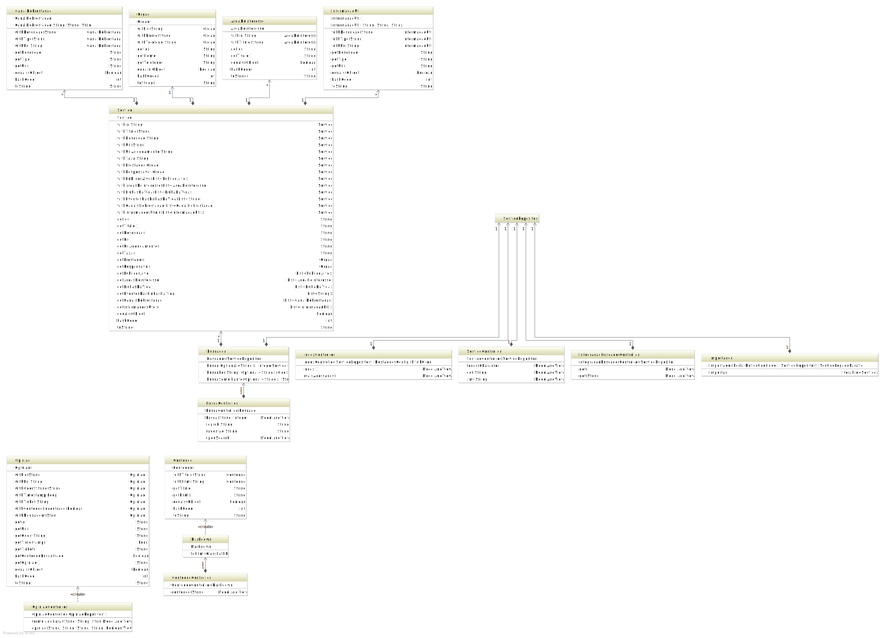

# Arquitetura

## Padrões técnicos

A implementação do Portal de Serviços é guiada por três padrões de desenho e construção de aplicações para a Web:

* [ePING]
* [ePWG]
* [eMAG]

[ePING]:http://www.governoeletronico.gov.br/acoes-e-projetos/e-ping-padroes-de-interoperabilidade
[ePWG]:http://www.governoeletronico.gov.br/acoes-e-projetos/padroes-brasil-e-gov
[eMAG]:http://www.governoeletronico.gov.br/acoes-e-projetos/e-MAG

## Visão geral

## Model-View-Controller

### Apresentação (View)

Os templates HTML 5 estão em `src/main/resources/templates`. Configuramos o [Thymeleaf] para tratar tanto arquivos HTML (`*.html`) quanto XML (`*.xml`) neste diretório como templates.

### Controladores

Controla a interação entre usuário e aplicação. Contém componentes responsáveis pela lógica de apresentação da aplicação e tem as responsabilidades de capturar dados, apresentar os resultados e controlar a navegação.

No mesmo nível estão os serviços expostos pela aplicação para interagir com outras aplicações.

Por convenção, _Controllers_ são nomeados com o sufixo `Controller` e anotados com `org.springframework.stereotype.Controller` ou `org.springframework.web.bind.annotation.RestController`.

### Modelos e objetos de domínio

Contém informações sobre o domínio do negócio, e mantém os objetos de negócio. Estão anotadas com `lombok.Value` (tornando-as imutáveis). Diversos objetos de domínio possuem anotações relacionadas a indexação e persistência no [ElasticSearch].

### Outros componentes

Coordenam atividades diversas da aplicação. Estão anotados com o estereótipo `org.springframework.stereotype.Component`.

[Thymeleaf]:http://www.thymeleaf.org
[ElasticSearch]:https://www.elastic.co/products/elasticsearch
