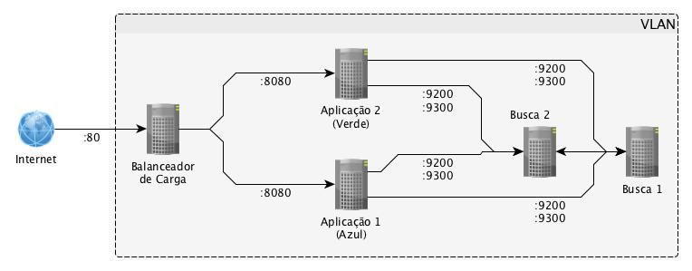

Implantação
----

### Visão de Implantação

Diagrama geral de um ambiente:

O sistema pode ser escalado através da adição de máquinas, tanto servidores de aplicação quanto de servidores de busca, permitindo escalabilidade horizontal.

Teremos 3 ambientes de implantação distintos: desenvolvimento, homologação e produção. Os dois primeiros possuem requisitos de hardware idênticos, enquanto produção possui mais processamento, memória e disco.

### Desenvolvimento e Homologação

Estes ambientes contém 5 máquinas virtuais:

* Balanceador de carga
* Servidor de Aplicação 1 (Azul)
* Servidor de Aplicação 2 (Verde)
* Servidor de Busca 1
* Servidor de Busca 2

|VM         |OS    |Versão|Arquitetura|Cores|Memória|Disco |Portas        |
|-----------|------|------|-----------|-----|-------|------|--------------|
|Balanceador|CentOS|7     |64bit      |2    |2 GB   |50+ GB|22, 80        |
|Aplicação 1|CentOS|7     |64bit      |2    |2 GB   |50+ GB|22, 8080      |
|Aplicação 2|CentOS|7     |64bit      |2    |2 GB   |50+ GB|22, 8080      |
|Busca 1    |CentOS|7     |64bit      |2    |2 GB   |50+ GB|22, 9200, 9300|
|Busca 2    |CentOS|7     |64bit      |2    |2 GB   |50+ GB|22, 9200, 9300|

No ambiente de desenvolvimento, também há um servidor de Integração Contínua (Jenkins), já provisionado e configurado, que deve ter acesso [ssh] às máquinas acima, através de chaves compartilhadas com a equipe de desenvolvimento do sistema.

#### Balanceador de Carga

CentOS 7, 64 bits, com 2gb de RAM e 50+ GB de disco. Roda um servidor [nginx] na porta 80, e um servidor [ssh] na porta 22.

[nginx]:http://www.nginx.org
[ssh]:http://www.openssh.com/

#### Servidores de Aplicação

CentOS 7, 64 bits, com 2gb de RAM e 50+ GB de disco. Roda a aplicação sob a [Java Virtual Machine][JVM] versão `1.8.0_40` ou superior, na porta 8080, e um servidor [ssh] na porta 22.

[JVM]:http://www.oracle.com/technetwork/java/javase/downloads/jdk8-downloads-2133151.html

#### Servidores de Busca

CentOS 7, 64 bits, com 2gb de RAM e 50+ GB de disco. Roda o [ElasticSearch] sob a [Java Virtual Machine][JVM] versão `1.8.0_40` ou superior, nas portas 9200 e 9300, e um servidor [ssh] na porta 22.

[ElasticSearch]:https://www.elastic.co/products/elasticsearch

### Produção

Este ambiente contém 5 máquinas virtuais:

* Balanceador de carga
* Servidor de Aplicação 1 (Azul)
* Servidor de Aplicação 2 (Verde)
* Servidor de Busca 1
* Servidor de Busca 2

|VM         |OS    |Versão|Arquitetura|Cores|Memória|Disco  |Portas        |
|-----------|------|------|-----------|-----|-------|-------|--------------|
|Balanceador|CentOS|7     |64bit      |4    |4 GB   |100+ GB|22, 80        |
|Aplicação 1|CentOS|7     |64bit      |4    |4 GB   |100+ GB|22, 8080      |
|Aplicação 2|CentOS|7     |64bit      |4    |4 GB   |100+ GB|22, 8080      |
|Busca 1    |CentOS|7     |64bit      |4    |4 GB   |100+ GB|22, 9200, 9300|
|Busca 2    |CentOS|7     |64bit      |4    |4 GB   |100+ GB|22, 9200, 9300|

#### Balanceador de Carga

CentOS 7, 64 bits, com 4 cores, 4gb de RAM e 100+ GB de disco. Roda um servidor [nginx] na porta 80, e um servidor [ssh] na porta 22.

[nginx]:http://www.nginx.org
[ssh]:http://www.openssh.com/

#### Servidores de Aplicação

CentOS 7, 64 bits, com 4 cores, 4gb de RAM e 100+ GB de disco. Roda a aplicação sob a [Java Virtual Machine][JVM] versão `1.8.0_40` ou superior, na porta 8080, e um servidor [ssh] na porta 22.

[JVM]:http://www.oracle.com/technetwork/java/javase/downloads/jdk8-downloads-2133151.html

#### Servidores de Busca

CentOS 7, 64 bits, com 4 cores, 4gb de RAM e 100+ GB de disco. Roda o [ElasticSearch] sob a [Java Virtual Machine][JVM] versão `1.8.0_40` ou superior, nas portas 9200 e 9300, e um servidor [ssh] na porta 22.

Componentes de Software
----

- Lombok (anotações)
- Pegdown (compilação de arquivos de conteúdo [Markdown])
- Slf4j (logging)
- Slugify (geração de IDs)
- Spring-Bboot (framework de desenvolvimento)
- Spring-Data-ElasticSearch (acesso ao [ElasticSearch])
- Thymeleaf (templates)
- Tomcat (servidor web)

Mais definições e detalhes sobre a arquitetura na seção [Arquitetura](./arquitetura.md)

[Markdown]:http://daringfireball.net/projects/markdown/

Instalação e Configuração
----

O passo `ARCHIVE` do [Snap-CI] gera arquivos [RPM] compatíveis com os ambientes descritos acima. Basta instalar o RPM nos servidores de aplicação e reiniciar:

	rpm -hiv https://snap-ci.com/servicosgovbr/guia-de-servicos/branch/master/…/guia-de-servicos-1.0.…-1.noarch.rpm

Para a URL exata do RPM para a implantação específica a fazer, é necessário consultar a lista de _build pipelines_ do [Snap-CI], em [https://snap-ci.com/servicosgovbr/guia-de-servicos/branch/master](https://snap-ci.com/servicosgovbr/guia-de-servicos/branch/master).

[Snap-CI]:http://snap-ci.com/
[RPM]:http://www.rpm.org/