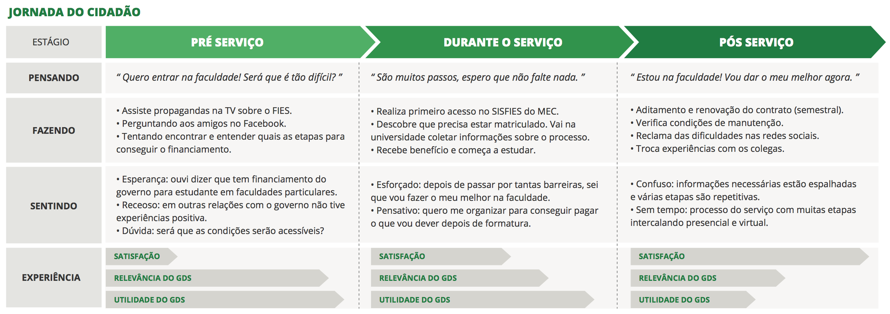

# Eduardo - Estudante

## Oportunidades percebidas

**Informações claras e objetivas:** Como muitos serviços contêm atividades sensíveis aos usuários, (envolvem dinheiro, por exemplo), é importante que a interface e o conteúdo sejam claros para que o cidadão possa ter segurança ao tomar determinadas decisões.

**Hierarquia das informações:** Para que o consumo dos conteúdos seja facilitado, é possível mostrar casos especiais de conteúdos (como valores, datas previstas) com diferentes aspectos visuais, gerando uma hierarquia de informações.

**Casos de sucesso:** Cidadãos podem compartilhar seus casos de sucesso com o Guia de Serviço, além de dicas que facilitaram seu processo, para que outros cidadãos tenham maior facilidade de resolver seus problemas pessoais.

**Interação além do site:** Em cenários onde o processo longo, é possível cadastrar materiais de suporte, como listas de etapas do processo para impressão, que o usuário poderá consultar e utilizar como controle ao longo de sua jornada.

